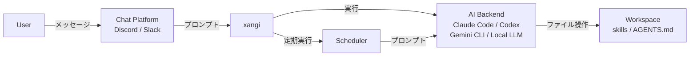

# 設計ドキュメント

xangiのアーキテクチャと設計思想について説明します。

## 概要

xangiは「AI CLI（Claude Code / Codex CLI / Gemini CLI）やローカルLLM（Ollama等）をチャットプラットフォームから使えるようにするラッパー」です。

```
User → Chat (Discord/Slack) → xangi → AI CLI → Workspace
```

## アーキテクチャ



### レイヤー構成

| レイヤー | 役割 | 実装 |
|----------|------|------|
| Chat | ユーザーインターフェース | Discord.js, Slack Bolt |
| xangi | AI CLIの統合・制御 | index.ts, agent-runner.ts |
| AI CLI | 実際のAI処理 | Claude Code, Codex CLI, Gemini CLI, Local LLM |
| Workspace | ファイル・スキル | skills/, AGENTS.md |

## コンポーネント

### エントリーポイント（index.ts）

メインのオーケストレーター。以下を統合：

- Discord/Slackクライアントの初期化
- メッセージ受信とルーティング
- AI CLIの呼び出し
- スケジューラーの管理
- コマンド処理（`!discord`, `!schedule` 等）

### エージェントランナー（agent-runner.ts）

AI CLIを抽象化するインターフェース：

```typescript
interface AgentRunner {
  run(prompt: string, options?: RunOptions): Promise<RunResult>;
  runStream(prompt: string, callbacks: StreamCallbacks, options?: RunOptions): Promise<RunResult>;
}
```

### システムプロンプト（base-runner.ts）

xangiがAI CLIに注入するシステムプロンプトを管理：

- **チャットプラットフォーム情報** — Discord/Slack経由の会話であることを伝える短い固定テキスト
- **XANGI_COMMANDS** — `src/prompts/` からプラットフォームに応じたコマンド仕様を注入
  - 共通コマンド（`xangi-commands-common.ts`）: ファイル送信・システムコマンド・スケジューラー等
  - Discord専用（`xangi-commands-discord.ts`）: `!discord send/history/search/delete/edit`・自動展開
  - Slack専用（`xangi-commands-slack.ts`）: Slack固有の操作
  - プラットフォーム自動判別: Discordのみ有効なら Discord専用コマンドだけ注入（トークン節約）
- **プラットフォーム識別** — 各メッセージに `[プラットフォーム: Discord]` or `[プラットフォーム: Slack]` を注入。AIが適切なコマンドを使い分け

AGENTS.md / CHARACTER.md / USER.md 等のワークスペース設定は、各AI CLIの自動読み込み機能に委譲：

| CLI | 自動読み込みファイル | 注入方法 |
|-----|---------------------|----------|
| Claude Code | `CLAUDE.md` | `--append-system-prompt`（一回限り） |
| Codex CLI | `AGENTS.md` | `<system-context>` タグで埋め込み |
| Gemini CLI | `GEMINI.md` | CLI側で自動読み込み（xangi側の注入なし） |
| Local LLM | `AGENTS.md`, `MEMORY.md` | システムプロンプトに直接埋め込み（`CLAUDE.md` は通常 `AGENTS.md` のシンボリックリンクのため除外） |

### AI CLIアダプター

| ファイル | 対応CLI | 特徴 |
|----------|---------|------|
| claude-code.ts | Claude Code | ストリーミング対応、セッション管理 |
| persistent-runner.ts | Claude Code（常駐） | `--input-format=stream-json` で常駐プロセス化、キュー管理、サーキットブレーカー |
| codex-cli.ts | Codex CLI | OpenAI製、0.98.0対応、cancel対応 |
| gemini-cli.ts | Gemini CLI | Google製、セッション管理、ストリーミング対応 |
| local-llm/runner.ts | Local LLM | Ollama等のローカルLLMを直接呼び出し、ツール実行・ストリーミング対応 |

#### Local LLMアダプターの詳細設計

**セッションリトライのフロー:**

```
1. ユーザーメッセージをセッション履歴に追加
   ↓
2. LLM APIにリクエスト送信
   ↓
3a. 成功 → ツールループ or 最終応答を返却
3b. エラー発生
   ↓
4. isSessionRelatedError() でエラーを判定
   - context length exceeded / too many tokens / max_tokens / context window
   - invalid message / malformed / 400 / 422
   ↓
5a. セッション起因のエラー → セッションをクリア（最後のユーザーメッセージのみ保持）→ リトライ
5b. セッション起因でない → formatLlmError() でユーザー向けメッセージを生成して返却
   ↓
6. リトライも失敗 → formatLlmError() でエラーメッセージを返却
```

**エラーハンドリングの設計:**

- `isSessionRelatedError()` — Error インスタンスのメッセージを小文字化して、セッション履歴に起因する既知のパターンにマッチするか判定。非Errorオブジェクトは常にfalseを返す
- `formatLlmError()` — 接続エラー・タイムアウト・認証エラー・レートリミット・サーバーエラーをそれぞれ日本語の分かりやすいメッセージに変換。非Errorオブジェクトにはデフォルトメッセージを返す
- コンテキスト刈り込み（`trimSession()`）— ツール結果の切り詰め、メッセージ数制限（MAX_SESSION_MESSAGES）、合計文字数制限（CONTEXT_MAX_CHARS）を直近メッセージ保護付きで実行

### スケジューラー（scheduler.ts）

定期実行とリマインダーを管理：

```
┌─────────────────────────────────────────────────────┐
│ Scheduler                                           │
├─────────────────────────────────────────────────────┤
│ - schedules: Schedule[]     # スケジュールデータ     │
│ - cronJobs: Map<id, CronJob> # 実行中のcronジョブ   │
│ - senders: Map<platform, fn> # メッセージ送信関数   │
│ - agentRunners: Map<platform, fn> # AI実行関数     │
├─────────────────────────────────────────────────────┤
│ + add(schedule): Schedule                          │
│ + remove(id): boolean                              │
│ + toggle(id): Schedule                             │
│ + list(): Schedule[]                               │
│ + startAll(): void                                 │
│ + stopAll(): void                                  │
└─────────────────────────────────────────────────────┘
```

**スケジュールの種類:**
- `cron`: cron式による定期実行
- `once`: 単発リマインダー（指定時刻に1回実行）

**永続化:**
- JSONファイル（`${DATA_DIR}/schedules.json`）
- ファイル変更を監視して自動リロード（debounce付き）

**タイムゾーン:**
- サーバーのシステムタイムゾーン（`TZ` 環境変数）に従う
- Docker環境では `TZ=Asia/Tokyo` 等を設定推奨

### スキルシステム（skills.ts）

ワークスペースの `skills/` ディレクトリからスキルを読み込み、スラッシュコマンドとして登録。

```
skills/
├── my-skill/
│   ├── SKILL.md      # スキル定義
│   └── scripts/      # 実行スクリプト
└── another-skill/
    └── SKILL.md
```

## データフロー

### メッセージ処理フロー

```
1. ユーザーがメッセージ送信
   ↓
2. Discord/Slackクライアントが受信
   ↓
3. 権限チェック（allowedUsers）
   ↓
4. 特殊コマンド判定
   - !discord → handleDiscordCommand()
   - !schedule → handleScheduleMessage()
   - /command → スラッシュコマンド処理
   ↓
5. チャンネル情報・発言者情報を付与
   ↓
6. AI CLIに転送（processPrompt）
   ↓
7. レスポンス処理
   - ストリーミング表示
   - ファイル添付抽出
   - SYSTEM_COMMAND検出
   - !discord / !schedule 検出・実行
   ↓
8. ユーザーに返信
```

### スケジュール実行フロー

```
1. cron/タイマーがトリガー
   ↓
2. Scheduler.executeSchedule()
   ↓
3. agentRunner(prompt, channelId)
   - AI CLIでプロンプト実行
   ↓
4. sender(channelId, result)
   - 結果をチャンネルに送信
   ↓
5. 単発の場合は自動削除
```

## 設計思想

### ユーザー管理

xangiのユーザー管理はシンプルな許可リスト方式：

- `DISCORD_ALLOWED_USER` / `SLACK_ALLOWED_USER` でアクセス制御
- カンマ区切りで複数ユーザー指定可能、`*` で全員許可
- セッションはチャンネル単位で管理
- プロンプトに発言者情報（表示名・Discord ID）が自動注入される

### AI CLIの抽象化

AI CLIの実装詳細を隠蔽し、交換可能に：

```typescript
// 設定でバックエンドを切り替え
AGENT_BACKEND=claude-code  # or codex or gemini or local-llm
```

将来的に新しいAI CLIが登場しても、アダプターを追加するだけで対応可能。

### コマンドの自律実行

AIが出力する特殊コマンドを検出して自動実行：

| コマンド | 動作 |
|----------|------|
| `SYSTEM_COMMAND:restart` | プロセス再起動 |
| `!discord send ...` | Discordメッセージ送信 |
| `!schedule ...` | スケジュール操作 |

これにより、AIが自律的にシステムを操作可能。

### 永続化戦略

| データ | 保存先 | 形式 |
|--------|--------|------|
| スケジュール | `${DATA_DIR}/schedules.json` | JSON |
| ランタイム設定 | `${WORKSPACE}/settings.json` | JSON |
| セッション | `${DATA_DIR}/sessions.json` | JSON（チャンネルID→セッションID） |
| トランスクリプト | `logs/transcripts/YYYY-MM-DD/{channelId}.jsonl` | JSONL（送信プロンプト・応答・エラー） |

### トランスクリプトログ

チャンネルごとのAI会話ログをJSONL形式で自動保存する機能。デバッグ・障害分析に使用。

**ディレクトリ構成：**
```
logs/transcripts/
  2026-03-08/
    1469606785672417383.jsonl   # チャンネルごとのログ
    1477591157423734785.jsonl
  2026-03-09/
    ...
```

**記録される内容：**
- `prompt`: ユーザーから送信されたプロンプト（タイムスタンプ・チャンネルトピック注入後）
- `response`: Claude Code の最終応答（result メッセージ）
- `error`: タイムアウト、API エラーなど

**注意事項：**
- ログは `.gitignore` で除外されている
- 自動ローテーション（日付ごとにディレクトリ分割）
- ログ書き込み失敗は無視（本体の動作に影響させない）

## ファイル構成

```
src/
├── index.ts            # エントリーポイント、Discord統合
├── slack.ts            # Slack統合
├── agent-runner.ts     # AI CLIインターフェース
├── base-runner.ts      # システムプロンプト生成、XANGI_COMMANDS.md読み込み
├── claude-code.ts      # Claude Codeアダプター（per-request）
├── persistent-runner.ts # Claude Codeアダプター（常駐プロセス）
├── codex-cli.ts        # Codex CLIアダプター
├── gemini-cli.ts       # Gemini CLIアダプター
├── local-llm/          # Local LLMアダプター
│   ├── runner.ts       #   メインランナー（セッション管理・ツール実行ループ）
│   ├── llm-client.ts   #   LLM APIクライアント（Ollama native + OpenAI互換）
│   ├── context.ts      #   ワークスペースコンテキスト読み込み
│   ├── tools.ts        #   ビルトインツール（exec/read/web_fetch）
│   └── types.ts        #   型定義
├── scheduler.ts        # スケジューラー
├── schedule-cli.ts     # スケジューラーCLI
├── skills.ts           # スキルローダー
├── config.ts           # 設定読み込み
├── settings.ts         # ランタイム設定
├── sessions.ts         # セッション管理
├── file-utils.ts       # ファイル操作ユーティリティ
├── process-manager.ts  # プロセス管理
├── runner-manager.ts   # 複数チャンネル同時処理（RunnerManager）
└── transcript-logger.ts # トランスクリプトログ

prompts/
└── XANGI_COMMANDS.md   # xangi専用コマンド仕様（AI CLIに注入）
```

## Docker構成

### コンテナ構成

```
┌─────────────────────────────────────────┐
│ xangi-max / xangi-gpu container         │
├─────────────────────────────────────────┤
│ - Node.js 22 + AI CLI + uv + Python    │
│ - xangi-gpu はさらに CUDA + PyTorch    │
└───────────────┬─────────────────────────┘
                │ docker network
┌───────────────▼─────────────────────────┐
│ ollama container                        │
├─────────────────────────────────────────┤
│ - Ollama公式イメージ                     │
│ - GPU パススルー                         │
│ - ollama:11434 で接続                   │
└─────────────────────────────────────────┘

┌─────────────────────────────────────────┐
│ llama-server container（オプション）     │
├─────────────────────────────────────────┤
│ - llama.cpp 公式イメージ                 │
│ - GPU パススルー                         │
│ - llama-server:18080 で接続             │
└─────────────────────────────────────────┘
```

### セキュリティ方針

- 非rootユーザー（UID 1000）で実行
- ワークスペースのみマウント
- AIエージェントへの環境変数はホワイトリスト方式で制限（`src/safe-env.ts`）
- ホストネットワークへの直接アクセスなし（ollamaコンテナ経由のみ）

詳細（環境変数一覧・Docker操作方法等）は [使い方ガイド](usage.md) を参照。

## 拡張ポイント

### 新しいチャットプラットフォーム追加

1. クライアント初期化コードを追加
2. メッセージハンドラを実装
3. `scheduler.registerSender()` で送信関数を登録
4. `scheduler.registerAgentRunner()` でAI実行関数を登録

### 新しいAI CLI追加

1. `AgentRunner` インターフェースを実装
2. `config.ts` にバックエンド設定を追加
3. `index.ts` で初期化処理を追加
