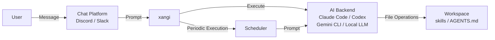

[日本語](../design.md) | **English**

# Design Document

This document explains the architecture and design philosophy of xangi.

## Overview

xangi is "a wrapper that makes AI CLIs (Claude Code / Codex CLI / Gemini CLI) and local LLMs (Ollama, etc.) accessible from chat platforms."

```
User → Chat (Discord/Slack) → xangi → AI CLI → Workspace
```

## Architecture



### Layer Structure

| Layer | Role | Implementation |
|-------|------|----------------|
| Chat | User interface | Discord.js, Slack Bolt |
| xangi | AI CLI integration & control | index.ts, agent-runner.ts |
| AI CLI | Actual AI processing | Claude Code, Codex CLI, Gemini CLI, Local LLM |
| Workspace | Files & skills | skills/, AGENTS.md |

## Components

### Entry Point (index.ts)

The main orchestrator. Integrates the following:

- Discord/Slack client initialization
- Message reception and routing
- AI CLI invocation
- Scheduler management
- Command handling (`!discord`, `!schedule`, etc.)

### Agent Runner (agent-runner.ts)

An interface that abstracts AI CLIs:

```typescript
interface AgentRunner {
  run(prompt: string, options?: RunOptions): Promise<RunResult>;
  runStream(prompt: string, callbacks: StreamCallbacks, options?: RunOptions): Promise<RunResult>;
}
```

### System Prompt (base-runner.ts)

Manages the system prompts that xangi injects into AI CLIs:

- **Chat platform info** — A short fixed text indicating the conversation is via Discord/Slack
- **XANGI_COMMANDS** — Injects platform-specific command specifications from `src/prompts/`
  - Common commands (`xangi-commands-common.ts`): File sending, system commands, scheduler, etc.
  - Discord-specific (`xangi-commands-discord.ts`): `!discord send/history/search/delete/edit`, auto-expand
  - Slack-specific (`xangi-commands-slack.ts`): Slack-specific operations
  - Automatic platform detection: If only Discord is active, only Discord-specific commands are injected (saves tokens)
- **Platform identification** — Each message is annotated with `[Platform: Discord]` or `[Platform: Slack]`. The AI uses the appropriate commands accordingly

AGENTS.md / CHARACTER.md / USER.md and other workspace settings are delegated to each AI CLI's auto-loading feature:

| CLI | Auto-loaded Files | Injection Method |
|-----|-------------------|------------------|
| Claude Code | `CLAUDE.md` | `--append-system-prompt` (one-time) |
| Codex CLI | `AGENTS.md` | Embedded via `<system-context>` tag |
| Gemini CLI | `GEMINI.md` | Auto-loaded by CLI (no xangi-side injection) |
| Local LLM | `AGENTS.md`, `MEMORY.md` | Directly embedded in system prompt (`CLAUDE.md` is typically a symlink to `AGENTS.md`, so it's excluded) |

### AI CLI Adapters

| File | Supported CLI | Features |
|------|---------------|----------|
| claude-code.ts | Claude Code | Streaming support, session management |
| persistent-runner.ts | Claude Code (persistent) | Persistent process via `--input-format=stream-json`, queue management, circuit breaker |
| codex-cli.ts | Codex CLI | Made by OpenAI, 0.98.0 compatible, cancel support |
| gemini-cli.ts | Gemini CLI | Made by Google, session management, streaming support |
| local-llm/runner.ts | Local LLM | Direct calls to local LLMs like Ollama, tool execution & streaming support |

#### Local LLM Adapter Detailed Design

**Session Retry Flow:**

```
1. Add user message to session history
   ↓
2. Send request to LLM API
   ↓
3a. Success → Return tool loop or final response
3b. Error occurred
   ↓
4. Evaluate error with isSessionRelatedError()
   - context length exceeded / too many tokens / max_tokens / context window
   - invalid message / malformed / 400 / 422
   ↓
5a. Session-related error → Clear session (keep only last user message) → Retry
5b. Not session-related → Generate user-facing message with formatLlmError() and return
   ↓
6. Retry also failed → Return error message via formatLlmError()
```

**Error Handling Design:**

- `isSessionRelatedError()` — Lowercases the Error instance message and checks if it matches known patterns caused by session history. Always returns false for non-Error objects
- `formatLlmError()` — Converts connection errors, timeouts, authentication errors, rate limits, and server errors into clear user-friendly messages. Returns a default message for non-Error objects
- Context trimming (`trimSession()`) — Executes tool result truncation, message count limiting (MAX_SESSION_MESSAGES), and total character limiting (CONTEXT_MAX_CHARS) with recent message protection

### Scheduler (scheduler.ts)

Manages periodic execution and reminders:

```
┌─────────────────────────────────────────────────────┐
│ Scheduler                                           │
├─────────────────────────────────────────────────────┤
│ - schedules: Schedule[]      # Schedule data        │
│ - cronJobs: Map<id, CronJob> # Running cron jobs    │
│ - senders: Map<platform, fn> # Message send funcs   │
│ - agentRunners: Map<platform, fn> # AI exec funcs   │
├─────────────────────────────────────────────────────┤
│ + add(schedule): Schedule                          │
│ + remove(id): boolean                              │
│ + toggle(id): Schedule                             │
│ + list(): Schedule[]                               │
│ + startAll(): void                                 │
│ + stopAll(): void                                  │
└─────────────────────────────────────────────────────┘
```

**Schedule Types:**
- `cron`: Periodic execution via cron expressions
- `once`: One-time reminder (executes once at a specified time)

**Persistence:**
- JSON file (`${DATA_DIR}/schedules.json`)
- Monitors file changes for automatic reload (with debounce)

**Timezone:**
- Follows the server's system timezone (`TZ` environment variable)
- In Docker environments, setting `TZ=Asia/Tokyo` etc. is recommended

### Skill System (skills.ts)

Loads skills from the `skills/` directory in the workspace and registers them as slash commands.

```
skills/
├── my-skill/
│   ├── SKILL.md      # Skill definition
│   └── scripts/      # Execution scripts
└── another-skill/
    └── SKILL.md
```

## Data Flow

### Message Processing Flow

```
1. User sends a message
   ↓
2. Discord/Slack client receives it
   ↓
3. Permission check (allowedUsers)
   ↓
4. Special command detection
   - !discord → handleDiscordCommand()
   - !schedule → handleScheduleMessage()
   - /command → Slash command handling
   ↓
5. Attach channel info and sender info
   ↓
6. Forward to AI CLI (processPrompt)
   ↓
7. Response processing
   - Streaming display
   - File attachment extraction
   - SYSTEM_COMMAND detection
   - !discord / !schedule detection & execution
   ↓
8. Reply to user
```

### Schedule Execution Flow

```
1. Cron/timer triggers
   ↓
2. Scheduler.executeSchedule()
   ↓
3. agentRunner(prompt, channelId)
   - Execute prompt via AI CLI
   ↓
4. sender(channelId, result)
   - Send result to channel
   ↓
5. Auto-delete if one-time
```

## Design Philosophy

### User Management

xangi's user management uses a simple allowlist approach:

- Access control via `DISCORD_ALLOWED_USER` / `SLACK_ALLOWED_USER`
- Multiple users can be specified with commas; `*` allows everyone
- Sessions are managed per channel
- Sender info (display name, Discord ID) is automatically injected into the prompt

### AI CLI Abstraction

Hides AI CLI implementation details and makes them interchangeable:

```typescript
// Switch backends via configuration
AGENT_BACKEND=claude-code  // or codex or gemini or local-llm
```

When new AI CLIs emerge in the future, support can be added simply by creating a new adapter.

### Autonomous Command Execution

Detects and automatically executes special commands output by the AI:

| Command | Action |
|---------|--------|
| `SYSTEM_COMMAND:restart` | Restart the process |
| `!discord send ...` | Send a Discord message |
| `!schedule ...` | Schedule operations |

This allows the AI to operate the system autonomously.

### Persistence Strategy

| Data | Storage Location | Format |
|------|-----------------|--------|
| Schedules | `${DATA_DIR}/schedules.json` | JSON |
| Runtime settings | `${WORKSPACE}/settings.json` | JSON |
| Sessions | `${DATA_DIR}/sessions.json` | JSON (channel ID → session ID) |
| Transcripts | `logs/transcripts/YYYY-MM-DD/{channelId}.jsonl` | JSONL (sent prompts, responses, errors) |

### Transcript Logs

Automatically saves per-channel AI conversation logs in JSONL format. Used for debugging and incident analysis.

**Directory Structure:**
```
logs/transcripts/
  2026-03-08/
    1469606785672417383.jsonl   # Per-channel logs
    1477591157423734785.jsonl
  2026-03-09/
    ...
```

**Recorded Content:**
- `prompt`: Prompt sent by the user (after timestamp and channel topic injection)
- `response`: Claude Code's final response (result message)
- `error`: Timeouts, API errors, etc.

**Notes:**
- Logs are excluded via `.gitignore`
- Automatic rotation (directory split by date)
- Log write failures are ignored (no impact on core functionality)

## File Structure

```
src/
├── index.ts            # Entry point, Discord integration
├── slack.ts            # Slack integration
├── agent-runner.ts     # AI CLI interface
├── base-runner.ts      # System prompt generation, XANGI_COMMANDS.md loading
├── claude-code.ts      # Claude Code adapter (per-request)
├── persistent-runner.ts # Claude Code adapter (persistent process)
├── codex-cli.ts        # Codex CLI adapter
├── gemini-cli.ts       # Gemini CLI adapter
├── local-llm/          # Local LLM adapter
│   ├── runner.ts       #   Main runner (session management, tool execution loop)
│   ├── llm-client.ts   #   LLM API client (Ollama native + OpenAI compatible)
│   ├── context.ts      #   Workspace context loading
│   ├── tools.ts        #   Built-in tools (exec/read/web_fetch)
│   └── types.ts        #   Type definitions
├── scheduler.ts        # Scheduler
├── schedule-cli.ts     # Scheduler CLI
├── skills.ts           # Skill loader
├── config.ts           # Configuration loading
├── settings.ts         # Runtime settings
├── sessions.ts         # Session management
├── file-utils.ts       # File operation utilities
├── process-manager.ts  # Process management
├── runner-manager.ts   # Multi-channel concurrent processing (RunnerManager)
└── transcript-logger.ts # Transcript logging

prompts/
└── XANGI_COMMANDS.md   # xangi-specific command specs (injected into AI CLI)
```

## Docker Architecture

### Container Structure

```
┌─────────────────────────────────────────┐
│ xangi-max / xangi-gpu container         │
├─────────────────────────────────────────┤
│ - Node.js 22 + AI CLI + uv + Python    │
│ - xangi-gpu additionally has CUDA +    │
│   PyTorch                               │
└───────────────┬─────────────────────────┘
                │ docker network
┌───────────────▼─────────────────────────┐
│ ollama container                        │
├─────────────────────────────────────────┤
│ - Ollama official image                 │
│ - GPU passthrough                       │
│ - Connect via ollama:11434              │
└─────────────────────────────────────────┘

┌─────────────────────────────────────────┐
│ llama-server container (optional)       │
├─────────────────────────────────────────┤
│ - llama.cpp official image              │
│ - GPU passthrough                       │
│ - Connect via llama-server:18080        │
└─────────────────────────────────────────┘
```

### Security Policy

- Runs as non-root user (UID 1000)
- Only the workspace is mounted
- Environment variables for the AI agent are restricted via whitelist (`src/safe-env.ts`)
- No direct access to host network (only via ollama container)

For details (environment variable reference, Docker operation methods, etc.), see the [Usage Guide](usage.md).

## Extension Points

### Adding a New Chat Platform

1. Add client initialization code
2. Implement the message handler
3. Register the send function via `scheduler.registerSender()`
4. Register the AI execution function via `scheduler.registerAgentRunner()`

### Adding a New AI CLI

1. Implement the `AgentRunner` interface
2. Add backend configuration to `config.ts`
3. Add initialization logic to `index.ts`
